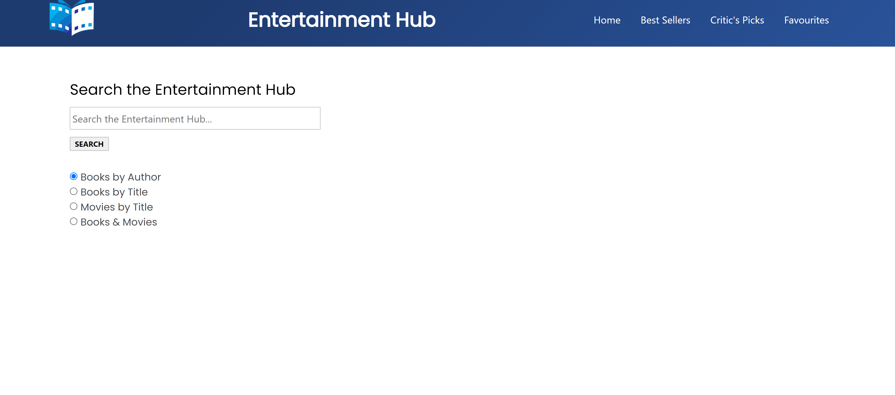
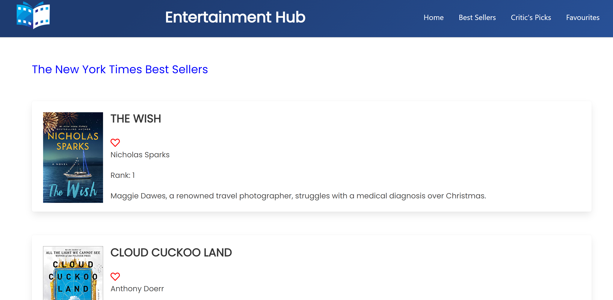
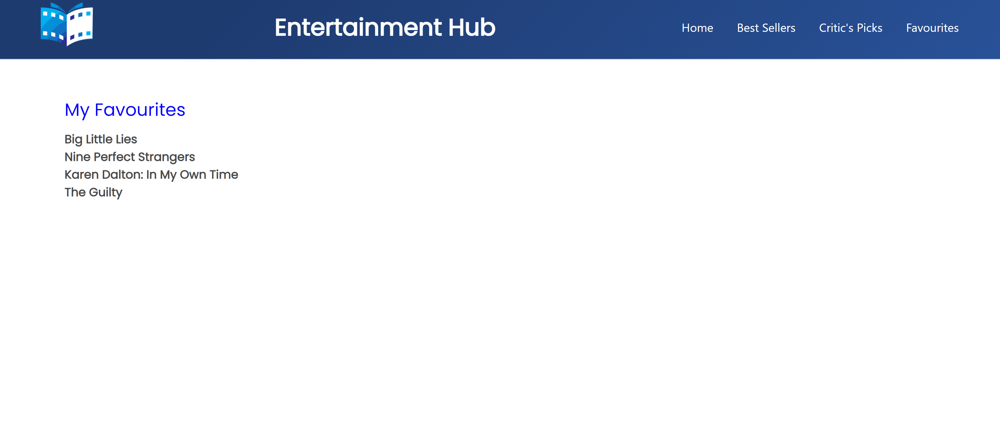

# The Entertainment Hub
# Overview

The Entertainment Hub is a web application that provides information about the current New York Times Best Sellers List, book and movie reviews and a list of critically acclaimed movies. A user can look up for a particular book or movie by title/author. 
The application presents relevant information about the book/movie with a short summary/review. 

The "Best Sellers" tab takes the user to a section which presents the top five best seller books with reviews.
The "Critics' picks" tab presents a list of critically acclaimed movies with reviews. 

The user is presented with the option to add any movie or book to his favourites list. The list of favourites are presented in the "Favourites" tab. 

This application uses the NewYork Times Books API and the NewYork Times Movies API.
The application is built using HTML5, CSS, JavaScript, jQuery and Bulma(CSS librabry).

Screen shots:

The Entertainment Hub: https://chaitra-srinivas.github.io/The-Entertainment-Hub/
